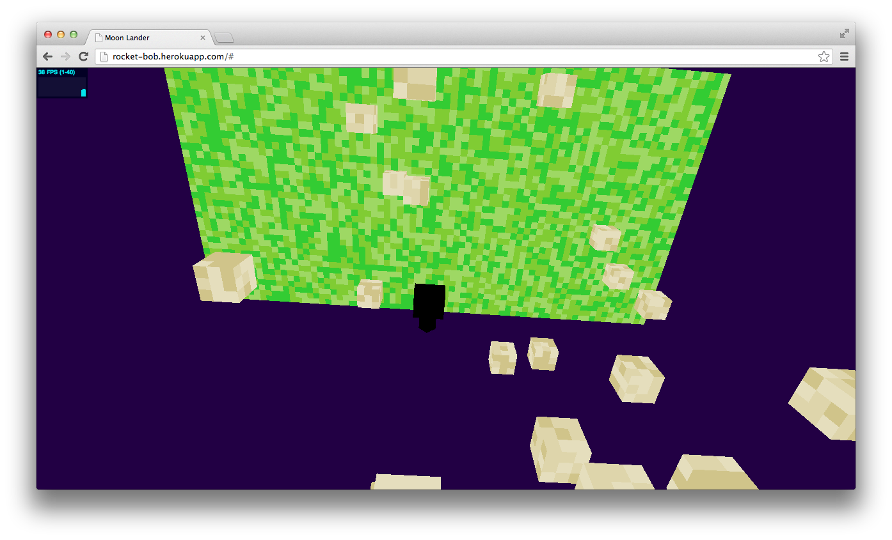

# RocketBob

Jump between planets while avoiding space debris and making a safe landing.

**Demo link** - <http://rocket-bob.herokuapp.com>

### Requirements

* Ruby
* Rails

### TODO

* Remove rails dependency (was used at the hackathon for the sake of asset pipeline)
* Make planets in parallel
* Fix rocket colors
* Add fire to rocket's tail
